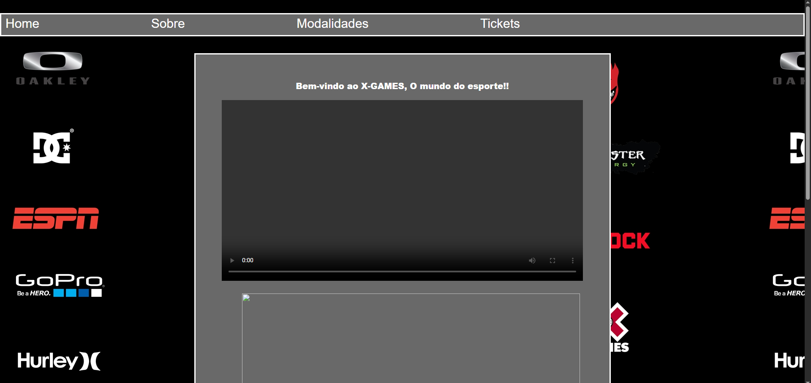
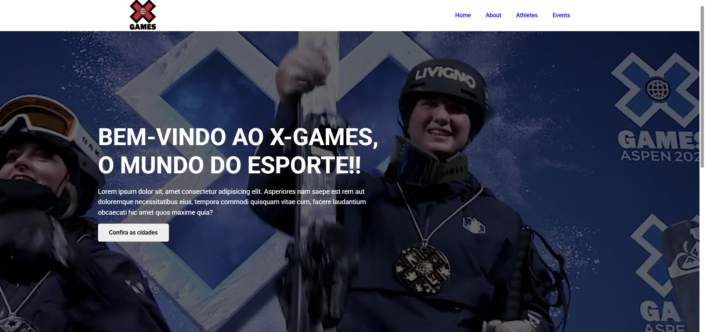

# X Games

# Sobre o projeto

é uma re-paginação de um trabalho realizado durante o curso técnico de informática na escola ETEC Polivalente de Americana em 2018. o intuito do trabalho era desenvolver um website simples de algo que gostamos. Durante o trabalho meu grupo desenvolveu um site com base no site oficial do XGames. Após 7 anos resolvi melhorar o trabalho, dando uma cara nova a ele.

# Tecnologias Utilizadas

HTML | CSS

# Site desenvolvido em 2018

# Atualização em 2025

